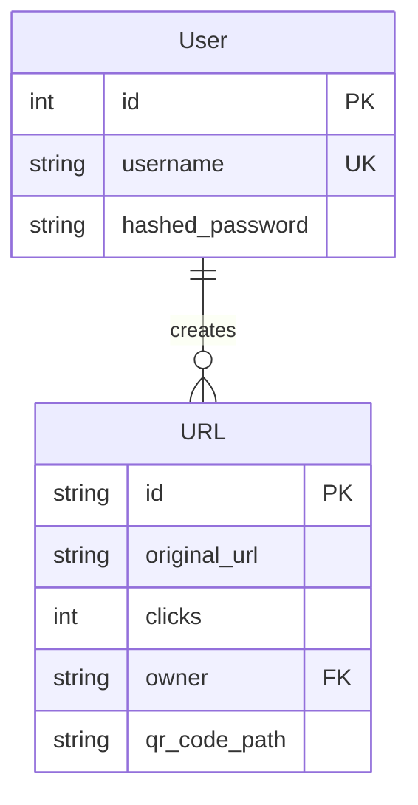

```mermaid
erDiagram
    URL {
        string id PK
        string original_url
        int clicks
        string owner FK
        string qr_code_path
    }
    
    User {
        int id PK
        string username UK
        string hashed_password
    }
    
    User ||--o{ URL : "creates"

%% Relationships:
%% - One User can create many URLs (1:N)
%% - Each URL must have one owner (User)
%% - Username is unique
%% - URL.owner references User.username

%% Notes:
%% PK = Primary Key
%% FK = Foreign Key
%% UK = Unique Key
``` 